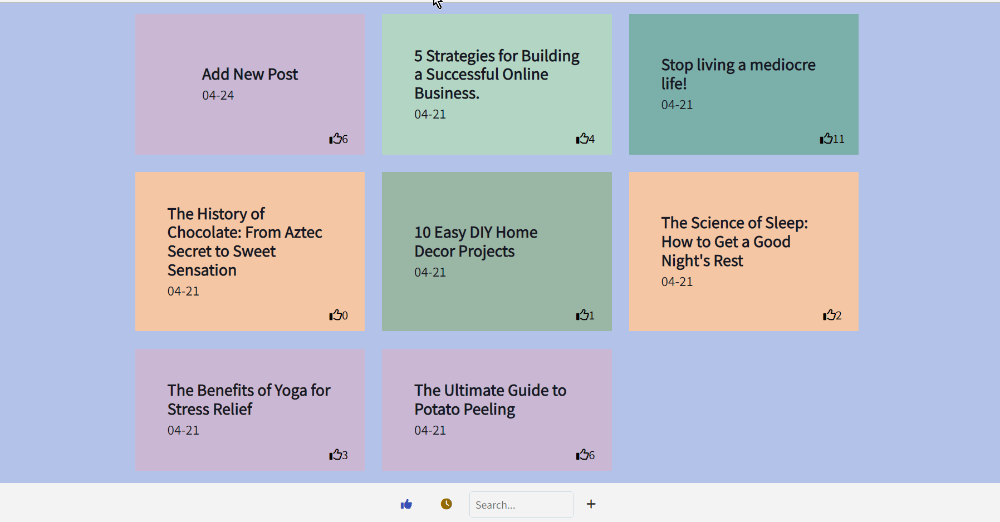

# *Anonymous Stories*

This web app allows users to anonymously share their deepest secrets on a website where others can relate and share their thoughts. 

## Technology Stack:
React & Supabase

## Video Walkthrough

Here's a walkthrough of implemented user stories:

## Features

The following functionality has been completed!

- [X] **A create form that allows the user to create posts**
- [X] **Posts have a title and optionally additional textual content and/or an image added as an external image URL**
- [X] **A home feed displaying previously created posts**
- [X] **By default, the time created, title, and number of upvotes for each post is shown on the feed**
- [X] **Clicking on a post shall direct the user to a new page for the selected post**
- [X] **Users can sort posts by either their created time or upvotes count**
- [X] **Users can search for posts by title**
- [X] **A separate post page for each created post, where any additional information is shown is linked whenever a user clicks a post**
- [X] **Users can leave comments underneath a post on the post's separate page**
- [X] **Each post should have an upvote button on the post's page. Each click increases its upvotes count by one and users can upvote any number of times**
- [X] **A previously created post can be edited or deleted from its post page**

# Future Feature Plans:

- [ ] Users can only edit and deleted posts or delete comments by entering the secret key, which is set by the user during post creation
- [ ] Upon launching the web app, the user is assigned a random user ID. It will be associated with all posts and comments that they make and displayed on them.
- [ ] Users can repost a previous post by referencing its post ID. On the post page of the new post, the referenced post is displayed and linked, creating a thread
- [ ] Users can customize the interface of the web app
- [ ] Users can share and view web videos
- [ ] Users can set flags while creating a post. Then users can filter posts by flags on the home feed.
- [ ] Users can upload images directly from their local machine as an image file
- [ ] Display a loading animation whenever data is being fetched

